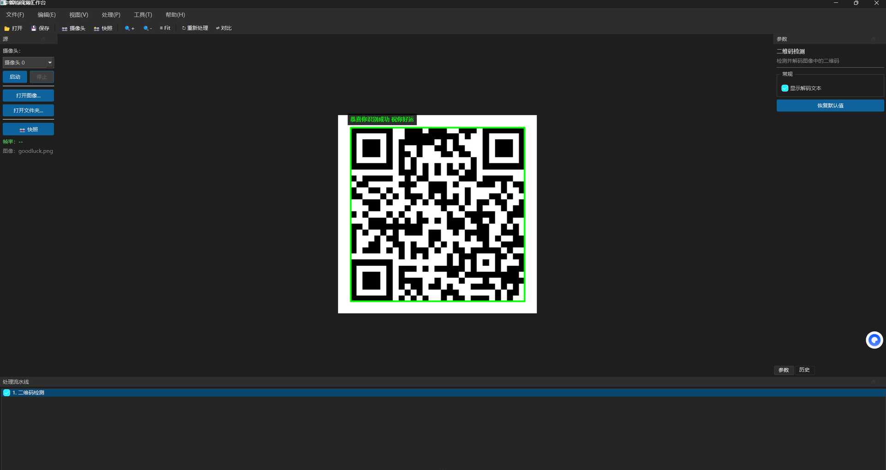
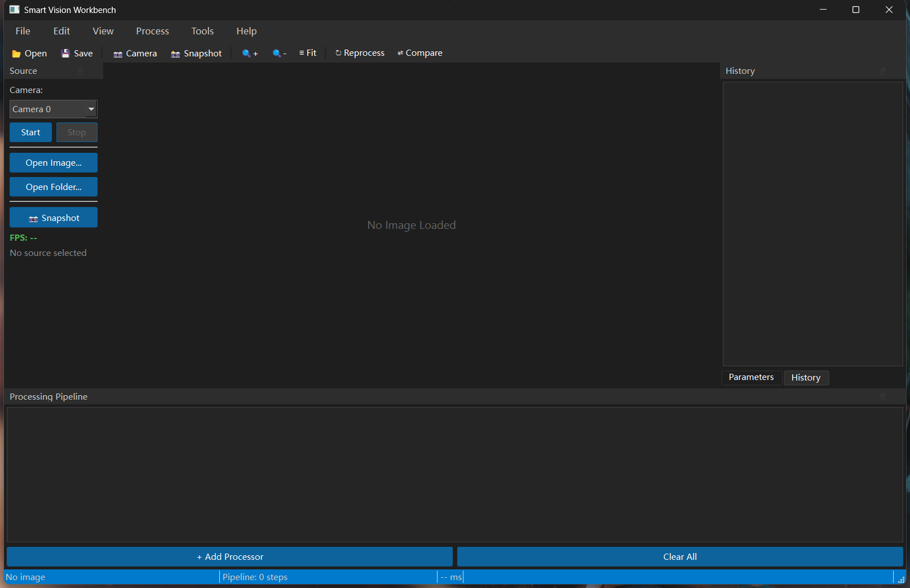
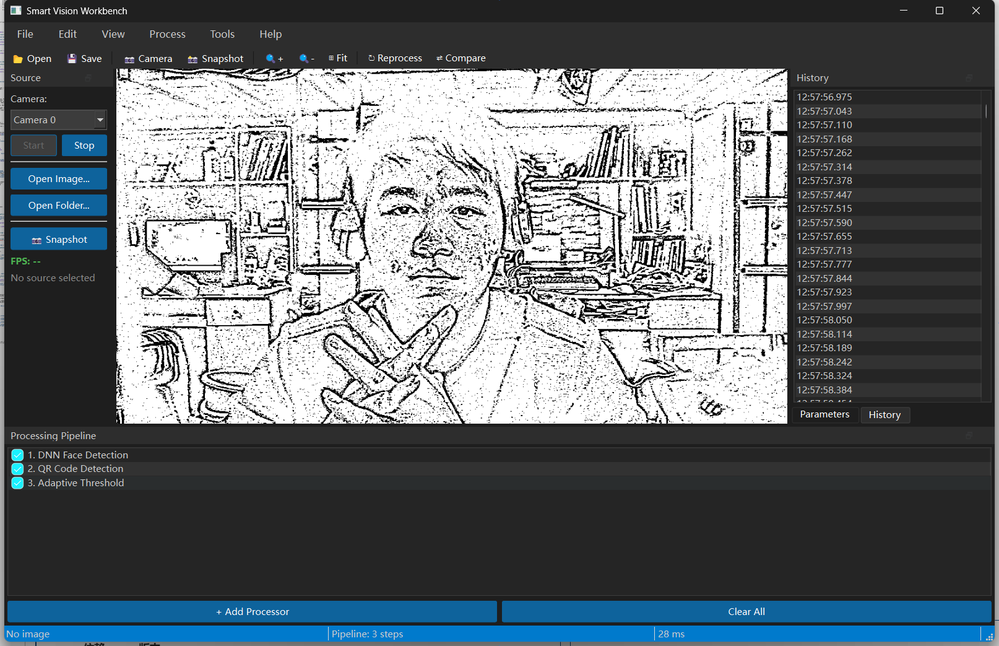
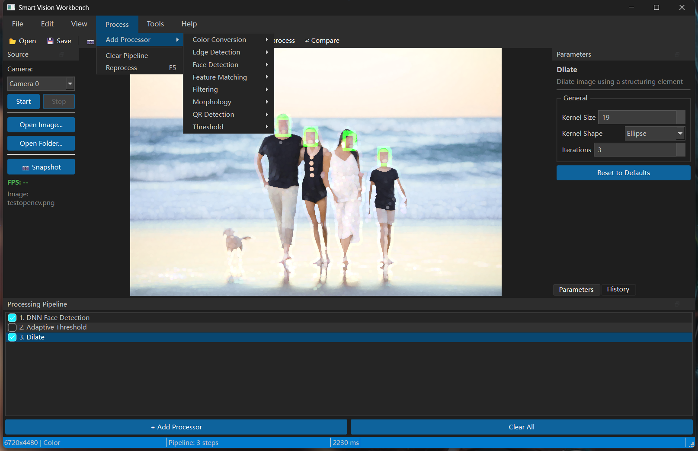
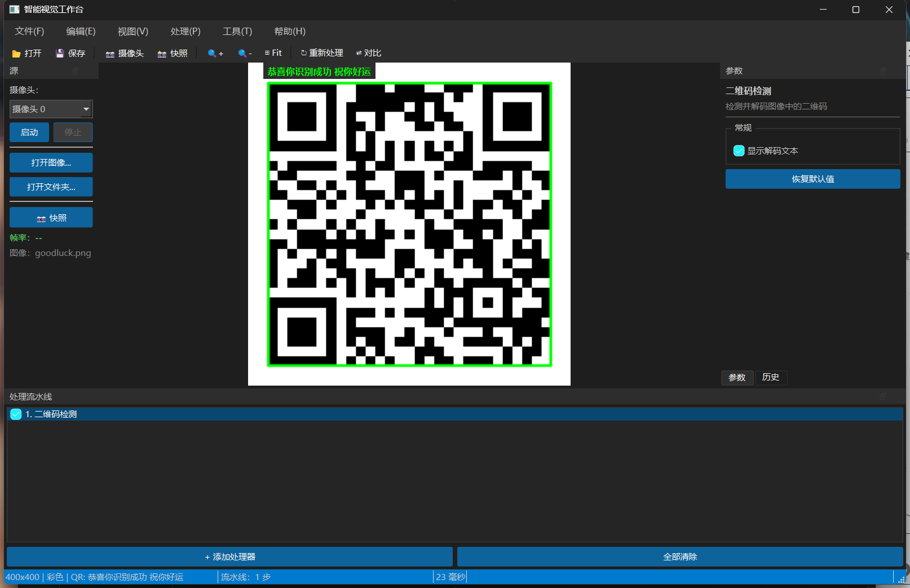
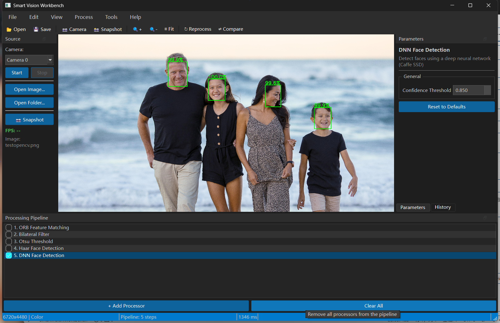
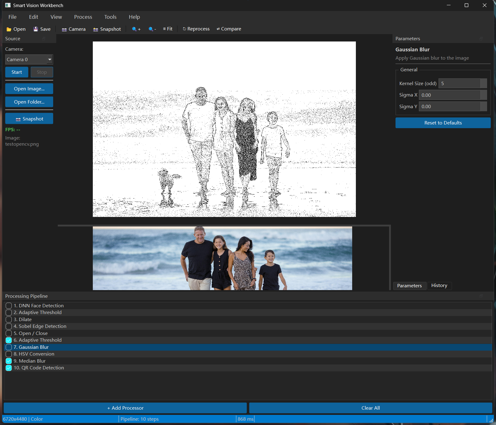

# Smart Vision Workbench

<p align="center">
  
</p>

<p align="center">
  <strong>A modular desktop computer-vision workbench built with Qt 6 and OpenCV</strong><br>
  Visual pipelines · Live camera · Plugin-based processors · Project save/load
</p>

<p align="center">
  <a href="README.zh-CN.md">中文文档</a> ·
  <a href="#features">Features</a> ·
  <a href="#processors">Processors</a> ·
  <a href="#screenshots">Screenshots</a> ·
  <a href="#quick-start">Quick Start</a> ·
  <a href="LICENSE">MIT License</a>
</p>

<p align="center">
  
  
  
  
  
</p>

---

**Smart Vision Workbench (SVW)** is an **original open-source** desktop application for prototyping and running vision workflows on still images and **live camera feeds**. Chain processors in a visual pipeline, tune parameters in real time, compare before/after results, and save your setup as a reusable project.

> **Original work** — application source code is MIT-licensed. Third-party models and libraries are credited in [Third-Party Notices](#third-party-notices).

---

## Features

| | |
|---|---|
| **Visual pipeline** | Add, reorder, enable/disable steps; per-step timing; reprocess with `F5` |
| **22 processors · 8 plugins** | Color, edges, threshold, morphology, filtering, faces, features, QR |
| **Live camera** | USB camera preview with async pipeline & frame-dropping (~28 ms) |
| **QR scanning** | Standard B/W & colored QR · UTF-8 / Chinese overlay · WeChat DNN fallback |
| **Face detection** | Haar cascade + DNN SSD with confidence scores on image |
| **Feature matching** | ORB / SIFT between current image and a reference image |
| **Comparison view** | Side-by-side, overlay, and diff modes (`Ctrl+D`) |
| **Project files** | Save/load `.svw` JSON (pipeline + parameters + image path) |
| **Internationalization** | English / 简体中文 UI with localized processor names |
| **Modern UI** | Dark theme, dockable panels, auto-generated parameter widgets |

---

## Screenshots

### Workspace

Dock-based layout: **Source** (camera / files), central **canvas** (pan & zoom), **Parameters** & **History**, and the **Processing Pipeline** strip at the bottom.

<p align="center">
  
</p>
<p align="center"><em>Main window — ready for image or camera input</em></p>

### Live Camera Mode

Connect a USB camera, stack processors, and see results in real time. The pipeline runs asynchronously and drops frames when needed to keep the UI responsive.

<p align="center">
  
</p>
<p align="center"><em>Camera 0 — DNN Face Detection + QR Code Detection + Adaptive Threshold · 28 ms</em></p>

### Processing Pipeline

Build multi-step chains from eight plugin modules. Toggle steps on/off and add processors from categorized menus.

<p align="center">
  
</p>
<p align="center"><em>Process → Add Processor — DNN Face Detection + Dilate in pipeline</em></p>

### QR Code Detection

Detect QR codes, draw a green bounding box, decode payload text, and render UTF-8 strings (including Chinese) on the canvas and in the status bar.

<p align="center">
  <table>
    <tr>
      <td align="center" width="50%">
        <br>
        <sub><b>English UI</b></sub>
      </td>
      <td align="center" width="50%">
        <br>
        <sub><b>简体中文</b></sub>
      </td>
    </tr>
  </table>
</p>
<p align="center"><em>Bounding box, decoded text overlay &amp; status bar · WeChat-style QR supported via DNN fallback</em></p>

### Face Detection (DNN)

SSD-based face detection with configurable confidence threshold and per-face score labels.

<p align="center">
  
</p>
<p align="center"><em>DNN Face Detection — confidence scores shown on a high-resolution photo</em></p>

### Before / After Comparison

Compare original and processed output while tuning a long pipeline.

<p align="center">
  
</p>
<p align="center"><em>Comparison view — 10-step pipeline (Gaussian Blur selected) · processed result vs. source</em></p>

---

## Processors

All processors are loaded at runtime from `plugins/`. Parameters appear automatically in the right dock when a step is selected.

### Color Conversion

| Processor | Description |
|-----------|-------------|
| **Grayscale** | Convert BGR image to single-channel grayscale |
| **HSV Conversion** | Convert BGR to HSV color space for hue/saturation-based analysis |

### Edge Detection

| Processor | Description |
|-----------|-------------|
| **Canny Edge Detection** | Multi-stage Canny edge detector with low/high thresholds |
| **Sobel Edge Detection** | Gradient-based edges along X, Y, or both axes |
| **Laplacian Edge Detection** | Second-derivative edge highlighting |

### Threshold

| Processor | Description |
|-----------|-------------|
| **Binary Threshold** | Fixed threshold to binary black/white |
| **Otsu Threshold** | Automatic optimal global threshold (Otsu's method) |
| **Adaptive Threshold** | Local adaptive binarization for uneven lighting — great for camera feeds |

### Morphology

| Processor | Description |
|-----------|-------------|
| **Dilate** | Expand bright regions — kernel size, shape, iterations |
| **Erode** | Shrink bright regions |
| **Open / Close** | Remove noise (open) or fill holes (close) |
| **Morphological Gradient** | Difference between dilation and erosion — outline extraction |

### Filtering

| Processor | Description |
|-----------|-------------|
| **Gaussian Blur** | Smooth noise with configurable kernel & sigma |
| **Median Blur** | Salt-and-pepper noise removal |
| **Bilateral Filter** | Edge-preserving smoothing |

### Face Detection

| Processor | Description | Model |
|-----------|-------------|-------|
| **Haar Face Detection** | Fast cascade-based detection (frontal + profile) | Bundled Haar XML |
| **DNN Face Detection** | Accurate Caffe SSD detector with confidence scores | `scripts\download_dnn_models.bat` |

### Feature Matching

Requires a **reference image** via `File → Open Reference Image…`.

| Processor | Description |
|-----------|-------------|
| **ORB Feature Matching** | Fast binary feature detection & matching between two images |
| **SIFT Feature Matching** | Scale-invariant feature matching (requires OpenCV SIFT module) |

### QR Detection

| Processor | Description | Model |
|-----------|-------------|-------|
| **QR Code Detection** | Detect & decode QR codes; UTF-8 text overlay; colored/WeChat QR fallback | Optional: `scripts\download_wechat_qr_models.bat` |

**QR capabilities:** standard B/W codes · colored / logo QR (multi-stage binarization + warp) · WeChat-style QR via `opencv_wechat_qrcode` DNN · on-canvas label + status bar preview.

---

## Requirements

| Component | Version |
|-----------|---------|
| **OS** | Windows 10/11 (primary), Linux / macOS compatible |
| **Compiler** | C++17 (MinGW 64-bit / MSVC / GCC / Clang) |
| **Qt** | 6.x (Widgets, Concurrent) |
| **OpenCV** | 4.x (core, imgproc, dnn, features2d, objdetect, videoio, wechat_qrcode…) |
| **CMake** | ≥ 3.16 |

---

## Quick Start

### 1. Clone

```bash
git clone https://github.com/yifanmoka-trace/-OpenCV-.git
cd -OpenCV-
```

### 2. Download optional models

| Model | Script | Used by |
|-------|--------|---------|
| DNN face (~10 MB) | `scripts\download_dnn_models.bat` | DNN Face Detection |
| WeChat QR (~1 MB) | `scripts\download_wechat_qr_models.bat` | Colored / stylized QR codes |

CMake copies models next to the executable on build.

### 3. Configure & build

```bash
cmake -S . -B build -DCMAKE_PREFIX_PATH=/path/to/Qt/6.x/mingw_64
cmake --build build --config Release
```

**Qt Creator:** open root `CMakeLists.txt` → select Qt 6 kit → Build.

### 4. Run

```
build/src/SmartVisionWorkbench.exe
```

Ensure `plugins/` and `models/` sit beside the executable.

---

## Usage

| Action | Shortcut / Location |
|--------|---------------------|
| Open image | `Ctrl+O` · Source panel |
| Start camera | Source panel → Camera → **Start** |
| Add processor | `Process → Add Processor` |
| Adjust parameters | Right dock · **Parameters** |
| Reprocess | `F5` |
| Toggle comparison | `Ctrl+D` · `View → Comparison Mode` |
| Reference image | `File → Open Reference Image…` (feature matching) |
| Switch language | `View → Language` |
| Save project | `Ctrl+S` (`.svw`) |
| Export result | `File → Export Result…` |
| Snapshot | Source panel · **Snapshot** |

**Image workflow:** open image → add processors → tune → `F5` → export or save project.

**Camera workflow:** select camera → **Start** → add processors → watch live output · use **Snapshot** to save a frame.

---

## Project Structure

```
SmartVisionWorkbench/
├── src/                    # Main application
│   ├── app/                # MainWindow, Application
│   ├── core/               # Pipeline, PluginManager, ImageData
│   ├── capture/            # Camera, file source, frame grabber
│   ├── ui/                 # Canvas, panels, comparison view
│   └── utils/              # Settings, paths, i18n, model resolution
├── plugins/                # 8 processor plugins (shared libraries)
├── resources/              # Cascades, DNN / WeChat models, QRC
├── translations/           # Qt Linguist sources (zh_CN)
├── docs/screenshots/       # README screenshots
├── scripts/                # Model download helpers
└── CMakeLists.txt
```

---

## Plugin Architecture

Each plugin implements `IImageProcessor` (and optionally `IPluginFactory`):

- **Discovery** — `PluginManager` scans `plugins/` at runtime
- **UI** — parameters auto-generated from `ParameterDescriptor` metadata
- **Execution** — pipeline runs asynchronously; camera mode drops frames to stay responsive
- **Localization** — processor names/descriptions translated via Qt Linguist

To add a plugin: copy an existing plugin folder, implement processors, register in root `CMakeLists.txt`.

---

## Install / Release

```bash
cmake --install build --prefix ./dist
```

See [docs/RELEASE_v1.0.0.md](docs/RELEASE_v1.0.0.md) for release notes.

---

## Configuration

**Edit → Preferences** — theme, plugin directory, models directory, camera resolution, history size, default compare mode, UI language.

---

## Third-Party Notices

| Component | License | Notes |
|-----------|---------|-------|
| [Qt 6](https://www.qt.io/) | LGPL / Commercial | GUI framework |
| [OpenCV](https://opencv.org/) | Apache 2.0 | Computer vision |
| Haar cascade | OpenCV / Intel | Face detection |
| DNN SSD face model | OpenCV 3rdparty | [opencv_3rdparty](https://github.com/opencv/opencv_3rdparty) |
| WeChat QR models | OpenCV 3rdparty | [WeChatCV/opencv_3rdparty](https://github.com/WeChatCV/opencv_3rdparty/tree/wechat_qrcode) |

Application source code is licensed under [MIT](LICENSE).

---

## Contributing

Issues and pull requests are welcome. Please open an issue before large changes.

---


## Author

**yifan** — [GitHub @yifanmoka-trace](https://github.com/yifanmoka-trace)

If this project helps you, consider giving it a ⭐ on GitHub.
